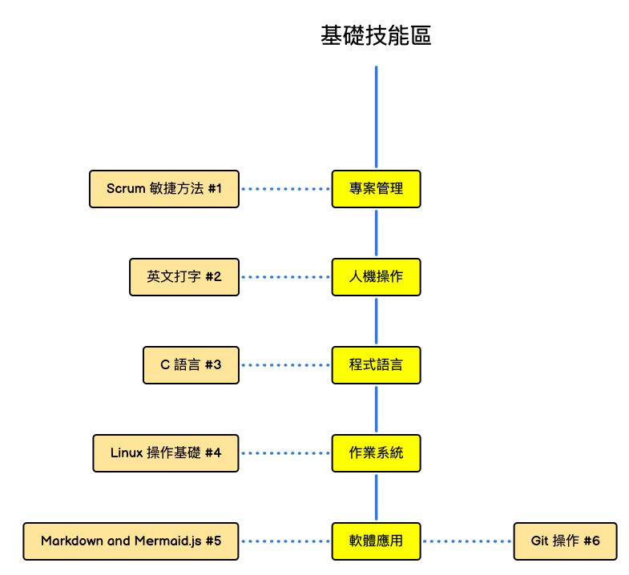

# 實驗室技能樹(2024-10)

### 建立強大的技術基礎：實驗室技能培養指南

在當今的技術驅動世界中，掌握基礎技能是成為成功技術專業人員的關鍵。為了確保實驗室成員具備必要的技術和知識，我們設立了一個以實用技能為核心的培訓計劃。

這篇文章將介紹我們目前在技術培養中涵蓋的五大基礎技能區域，以及它們如何幫助我們的成員在實際工作中應用。

- [2024年10月的基礎技能培養規劃](https://roadmap.sh/r/embed?id=66fb5e41e52a9bf4762f16c8)

<!-- truncate -->

---

#### 1. 專案管理：Scrum 敏捷方法

專案管理是開發流程中不可或缺的一環。我們採用 **Scrum 敏捷方法** 來幫助成員學習如何高效管理項目。Scrum 的核心在於將複雜的專案分解為短期可管理的 Sprint，並且通過每日 Stand-up 會議促進團隊溝通與合作。這種方法能夠幫助開發者靈活應對需求變更，並保持高效交付產品。

**學習要點：**
- 如何計劃並管理 Sprint
- 有效的每日會議與回顧會
- 迭代式交付與持續改進

---

#### 2. 人機操作：英文打字技能

在全球化的技術環境中，英文是最常用的編程語言和交流工具，因此打字速度和準確性至關重要。我們的成員在日常的打字練習中不僅提高了文字處理的效率，還為未來的編程和文檔撰寫奠定了堅實基礎。流利的 **英文打字** 將有助於他們在技術報告、溝通和編程時事半功倍。

**學習要點：**
- 提升每分鐘打字速度（WPM）
- 減少打字錯誤，提高準確率
- 熟練使用標準鍵盤布局

---

#### 3. 程式語言：C 語言

**C 語言** 是許多高級編程語言的基礎。通過掌握 C 語言，成員能夠深入了解底層計算機運行機制，如指針操作、內存管理和硬件交互。這些技能在嵌入式系統和高效能運算中尤為重要。C 語言的學習還為後續更高層次的語言學習提供了強大基礎。

**學習要點：**
- 基本語法結構與邏輯
- 指針與內存操作
- C 語言的應用場景與實例

---

#### 4. 作業系統：Linux 操作基礎

作為一個開放源碼且高度可定制的系統，**Linux** 是開發人員和系統管理員的首選操作系統。成員將學習如何安裝、配置和操作 Linux，並熟悉命令行工具以進行高效的系統操作與管理。這些技能將幫助成員們在工作中快速解決問題，並自如地操作伺服器與開發環境。

**學習要點：**
- 基本命令行操作
- 文件與權限管理
- 軟件包管理與系統監控

---

#### 5. 軟體應用：Markdown、Mermaid.js 與 Git

為了提高工作效率和文件可讀性，**Markdown** 提供了一種簡單的標記語言來撰寫文檔，並能夠通過 **Mermaid.js** 進行流程圖的視覺化展示，這對於專案協作和技術文件編寫至關重要。此外，**Git** 是現代開發中不可或缺的版本控制工具，成員將學習如何使用 Git 進行代碼管理、協作開發，並掌握分支與合併的最佳實踐。

**學習要點：**
- Markdown 語法與技術文檔撰寫
- Mermaid.js 流程圖創建
- Git 的基本操作：提交、分支、合併與衝突解決

---

### 結語

技術的進步來自於穩固的基礎。這些技能不僅是技術人員的必備知識，更是推動創新與高效工作的基石。通過本實驗室的技術培養計劃，我們相信成員將能夠在技術生涯中走得更遠，並在未來的項目中發揮更大的價值。

讓我們一起努力，從基礎做起，創造更多的技術奇蹟！
